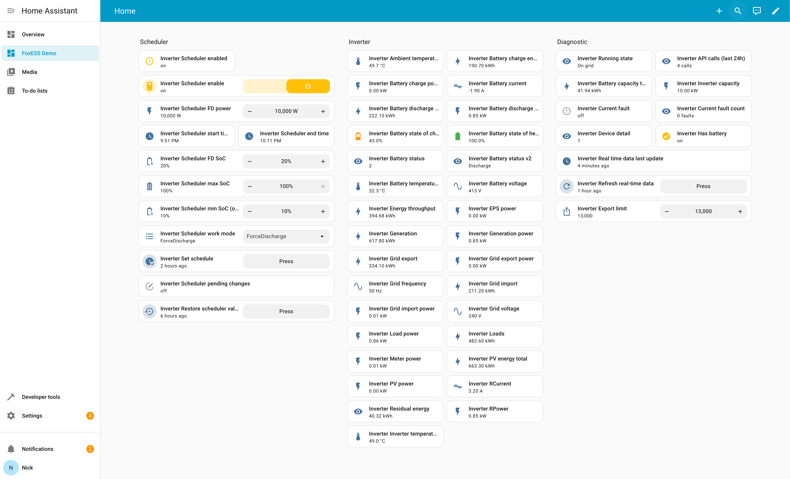
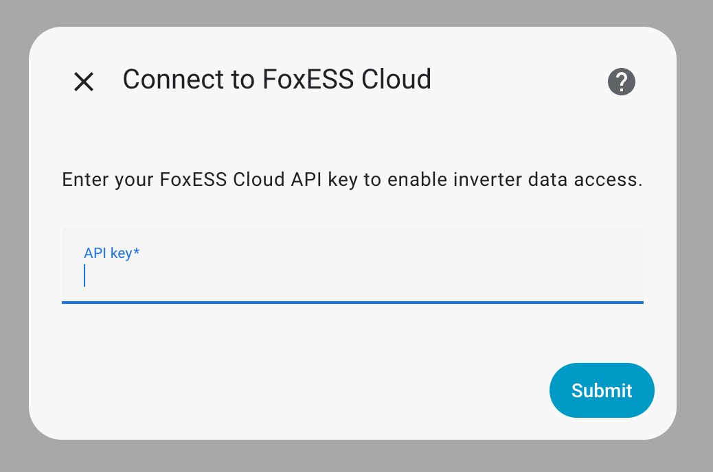
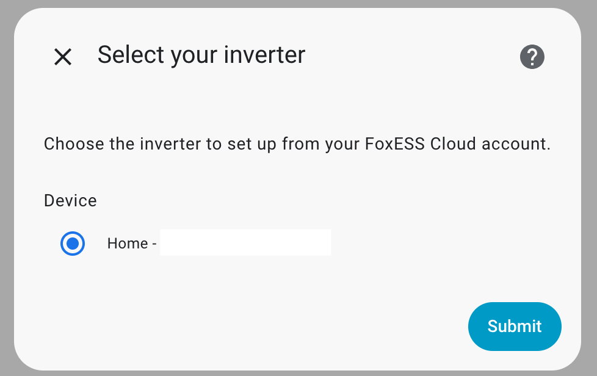
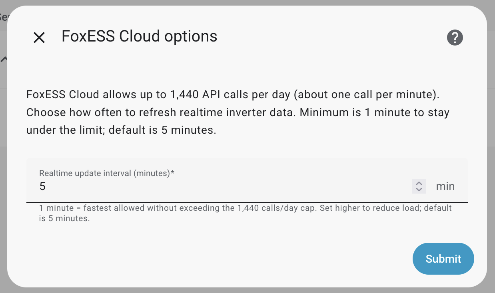
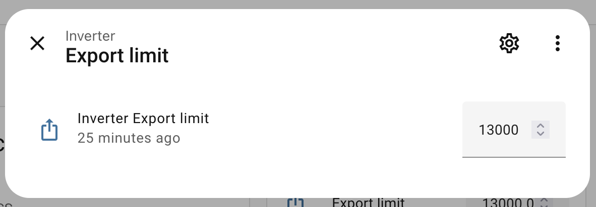
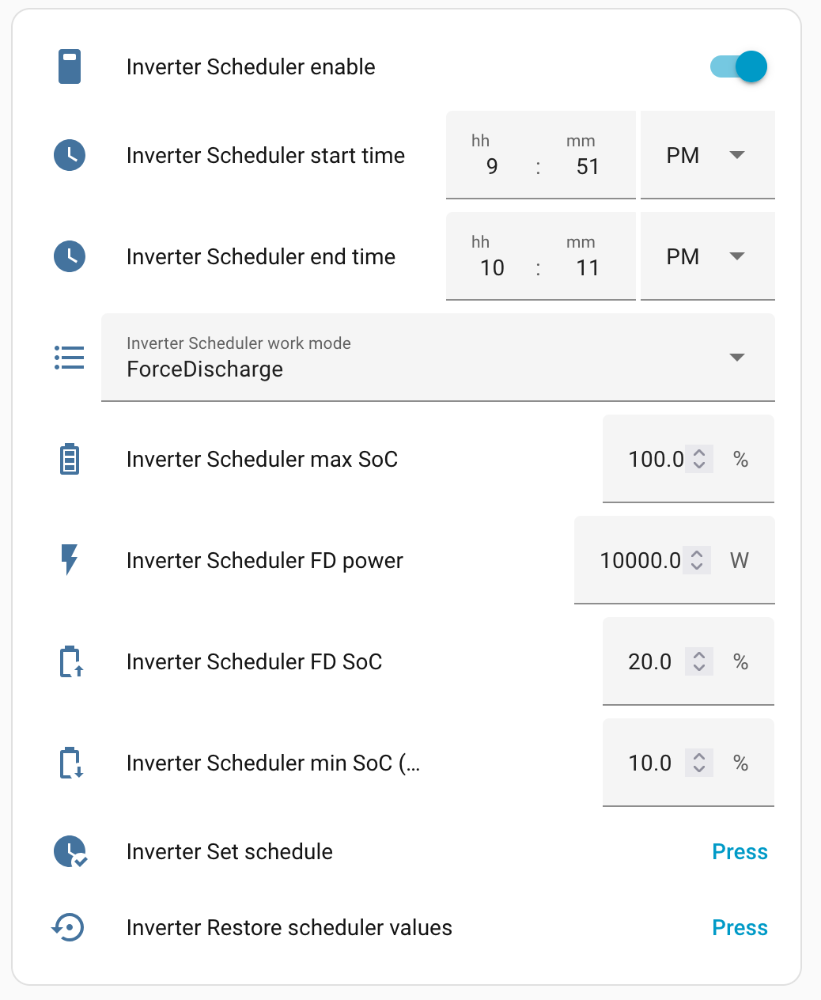

# FoxESS Cloud for Home Assistant

Home Assistant integration for FoxESS Cloud. It reads inverter and battery telemetry and lets you apply device settings and schedules over the cloud, without needing Modbus wiring.


If you're moving to Amber for wholesale rates, you can use my referral code [`HDQC97DV`](https://mates.amber.com.au/HDQC97DV?utm_source=amber&utm_medium=app&utm_campaign=AE537_Multi_Traffic_Generic&utm_term=&utm_content=referral_share_link); it helps support this project and gives you $120 off.

> Why this integration? If you only need telemetry, other FoxESS integrations (e.g., [macxq/foxess-ha](https://github.com/macxq/foxess-ha)) may be enough. Use this one when you also want to control the inverter from Home Assistant by adjusting device settings and schedules via the FoxESS Cloud API.

## Screenshots


| Config flow: API key | Config flow: select device |
| --- | --- |
|  |  |



## Support the project
- Buy me a coffee: https://buymeacoffee.com/nickw444
- GitHub Sponsors: [Sponsor nickw444 on GitHub](https://github.com/sponsors/nickw444)

## Tested hardware
- FoxESS KH10

## Highlights
- Guided config flow: paste your FoxESS Cloud API key, then pick the inverter from your account.
- Real-time telemetry exposed as sensors: PV strings, grid voltage/frequency, load/feed-in, battery SoC/temperature/power, energy totals, and diagnostics (last update, raw device detail, API call counter, running state, fault info).
- Scheduler control: staging entities (select/number/time/button/switch) to adjust work mode and times, with binary sensors for scheduler enabled/dirty state when supported.
- Device settings: numbers for export limit and battery SoC ranges.
- Integration service `foxess_cloud.set_schedule` to push scheduler groups to the inverter; overwrites existing schedules.

## Requirements
- FoxESS Cloud account with an API key.

## Installation
### HACS (recommended)
1. In HACS → Integrations, add this repository as a Custom Repository (type: Integration).
2. Install **FoxESS Cloud**.
3. Restart Home Assistant.

### Manual
1. Copy `custom_components/foxess_cloud` into your Home Assistant `config/custom_components/` directory.
2. Restart Home Assistant.

## Setup
1. Go to **Settings → Devices & Services → Add Integration → FoxESS Cloud**.
2. Enter your API key; the config flow will scan your account and list available inverters—pick one from the dropdown (no serial number lookup needed).
3. (Optional) Open the integration **Options** to change the real-time update interval (1–60 minutes, default 5).
   - FoxESS Cloud rate limit is 1,440 API calls per day (~1 call/min). Keep the realtime interval at 1 minute or higher to stay under the limit; use longer intervals if other apps (e.g., Amber, Octopus Energy) are also using your API key.

## Entities and services
- Sensors cover PV string voltage/current/power, grid measurements, battery state of charge/temperature/power, load/generation/feed-in totals, and diagnostic helpers.
- Binary sensors report scheduler enabled/dirty status (if supported), battery presence, and current fault state.
- Select/number/time/button/switch entities stage scheduler parameters before sending them.
- Service `foxess_cloud.set_schedule` writes scheduler groups to the inverter. Payload example (two groups):
  ```yaml
  device_sn: ABC1234567
  groups:
    - enable: 1
      startHour: 0
      startMinute: 0
      endHour: 6
      endMinute: 0
      workMode: ForceCharge
      minSocOnGrid: 20
      fdSoc: 80
      fdPwr: 2000
      maxSoc: 90
    - enable: 1
      startHour: 12
      startMinute: 0
      endHour: 15
      endMinute: 30
      workMode: Feedin
      fdSoc: 30
      fdPwr: 1000
  ```

## Solar curtailment
- Use the `export_limit` number entity to cap grid export. Set it to `0` to fully curtail export; raise it to allow export up to the specified watt limit.
- Example:



## Work mode
- Exposed as a Select entity backed by the `WorkMode` device setting (options: SelfUse, Feedin, Backup, PeakShaving).
- Enabled by default with a 15-minute poll interval.
- ForceCharge and ForceDischarge aren't supported on this entity; set them via a schedule instead.
- When a schedule is active, FoxESS Cloud returns `error code 44096: Unsupported function code; result=None` for work mode updates; disable the schedule first, then change work mode.

## Scheduler
- UI staging supports a single scheduler slot. Set the desired parameters (work mode, times, SOC/power limits) using the staging entities, then click the **Set Schedule** button entity to send it.
- The `foxess_cloud.set_schedule` service accepts multiple groups in one call (see example above). When you need more than one slot, call the service with the `groups` list. An empty list clears all schedules.
- Warning: writing a schedule from Home Assistant overwrites all schedules on the inverter (including when sending an empty list).
- Example entities view:



## Developing / API client CLI
- Install deps with `uv sync`.
- List available CLI commands: `PYTHONPATH=custom_components/foxess_cloud uv run python -m api_client.__main__ --help`.
- Example: list inverters with `PYTHONPATH=custom_components/foxess_cloud uv run python -m api_client.__main__ --api-key YOUR_KEY list-inverters`.
- The CLI runs outside Home Assistant for quick FoxESS Cloud API checks (settings, realtime, scheduler).
